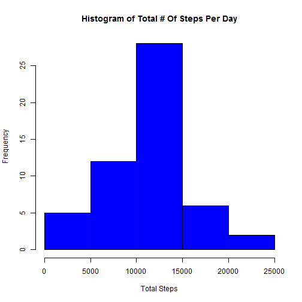
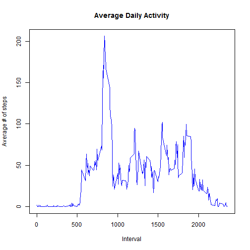
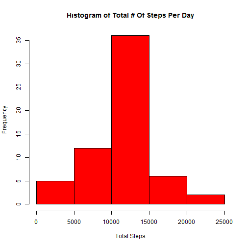

#Loading and preprocessing the data


##Load and process / transform the activity data into a format for analysis

```r
# 1. Load the activity data
Data <- read.csv("C:/HHA Files/HaiAik Files/Personal/Coursera/Data Science/WD/RR_Assignment1/activity.csv")

# 2. Process or transform the date column to date class
Data$date <- as.Date(Data$date)
```

##Questions and Answers

####Question: What is mean total number of steps taken per day?
(Note that for this part, missing values in the dataset are to be ignored)

1. Make a histogram of the total number of steps taken each day


```r
# Clean up the data
CleanData <- Data[!is.na(Data$steps),]

# Load plyr library
library(plyr)
```

```
## Warning: package 'plyr' was built under R version 3.1.2
```

```r
# Group by Date
ByDate <- ddply(CleanData, ~date, summarise, sum = sum(steps))

#Plot histogram
hist(ByDate$sum, xlab = "Total Steps", main = "Histogram of Total # Of Steps Per Day", col = "blue")
```

 

2. Calculate and report the mean and median total number of steps taken per day


```r
# Calculate mean value
mean <- mean(ByDate$sum)

# Calculate median value
median <- median(ByDate$sum)
```
The mean and median total number of steps taken per day are 1.0766189 &times; 10<sup>4</sup> and 10765 respectively.

####Question: What is the average daily activity pattern?

1. Make a time series plot (i.e. type = "l") of the 5-minute interval (x-axis) and the average number of steps taken, averaged across all days (y-axis)


```r
# Time series plot with 5min interval of ave steps taken vs ave across all days
ByInterval <- ddply(CleanData, ~interval, summarise, mean = mean(steps))
with(ByInterval, plot(interval, mean, type = "l", ylab = "Average # of steps", 
    xlab = "Interval", main = "Average Daily Activity", col = "blue"))
```

 

2. Which 5-minute interval, on average across all the days in the dataset, contains the maximum number of steps?


```r
# Find max
Max <- max(ByInterval$mean)

# locate the line containing max value
Line <- ByInterval[ByInterval$mean == Max, ]

# Find the max interval
MaxInterval <- Line$interval
```
835 is the 5min interval, on average across all the days in the dataset, that contains the maximum number of steps. Maximum number of steps is 206.1698113.

####Question: Imputing missing values

1. Calculate and report the total number of missing values in the dataset (i.e. the total number of rows with NAs)


```r
#Find number of missing value
SumNA <- sum(is.na(Data$steps))
```
There are total of 2304 rows with NA in the dataset.  

2. Devise a strategy for filling in all of the missing values in the dataset. The strategy does not need to be sophisticated. For example, you could use the mean/median for that day, or the mean for that 5-minute interval, etc.


```r
# To use mean
# Create another dataset
Data2 <- Data

# Find missing data
missing <- is.na(Data2$steps)

# Convert
Data2$interval <- factor(Data2$interval)
ByInterval$interval <- factor(ByInterval$interval)
```

3. Create a new dataset that is equal to the original dataset but with the missing data filled in.

```r
# Fill missing values
Data2[missing, "steps"] <- ByInterval[Data2[missing, "interval"],"mean"]
```

4. Make a histogram of the total number of steps taken each day and Calculate and report the mean and median total number of steps taken per day. Do these values differ from the estimates from the first part of the assignment? What is the impact of imputing missing data on the estimates of the total daily number of steps?


```r
# Group by Date
ByDate2 <- ddply(Data2, ~date, summarise, sum = sum(steps))

# Plot histogram
hist(ByDate2$sum, xlab = "Total Steps", main = "Histogram of Total # Of Steps Per Day", col = "red")
```

 

```r
# Calculate new mean value
mean2 <- mean(ByDate2$sum)

# Calculate new median value
median2 <- median(ByDate2$sum)
```

The new mean and median total number of steps taken per day are 1.0766189 &times; 10<sup>4</sup> and 1.0766189 &times; 10<sup>4</sup> respectively vs previous values of 1.0766189 &times; 10<sup>4</sup> and 10765. As seen from the values, impact of imputing missing values is minimal.

####Question: Are there differences in activity patterns between weekdays and weekends?
For this part the weekdays() function may be of some help here. Use the dataset with the filled-in missing values for this part.

1.Create a new factor variable in the dataset with two levels - "weekday" and "weekend" indicating whether a given date is a weekday or weekend day.


```r
# Add a new column for day of week
Data2$day = weekdays(Data2$date)

# Add a new column to indicate whether it is Weekday or Weekend
Data2$daytype <- ifelse(Data2$day == "Saturday" | Data2$day == "Sunday", "Weekend", "Weekday")
# Convert column
Data2$daytype <- factor(Data2$daytype)
```

2.Make a panel plot containing a time series plot (i.e. type = "l") of the 5-minute interval (x-axis) and the average number of steps taken, averaged across all weekday days or weekend days (y-axis). See the README file in the GitHub repository to see an example of what this plot should look like using simulated data.


```r
# Make a new dataset and group data by interval and day type
ByIntervalDay <- ddply(Data2, ~interval + daytype, summarise, mean = mean(steps))

# Make Plot
ByIntervalDay$interval <- as.numeric(as.character(ByIntervalDay$interval))

# Load lattice
library(lattice)
xyplot(mean ~ interval | daytype, ByIntervalDay, type = "l", layout = c(1, 2), xlab = "Interval", ylab = "Number of steps")
```

 
